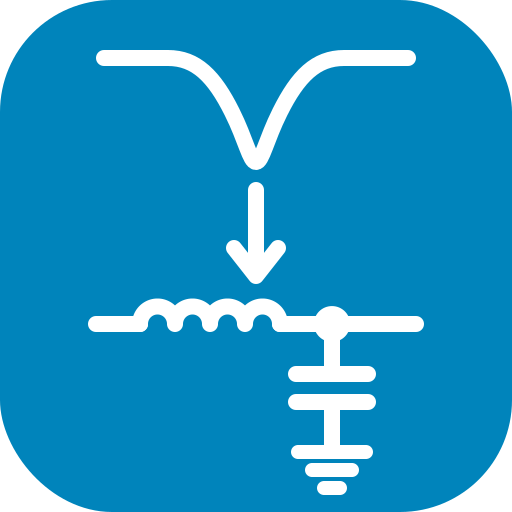
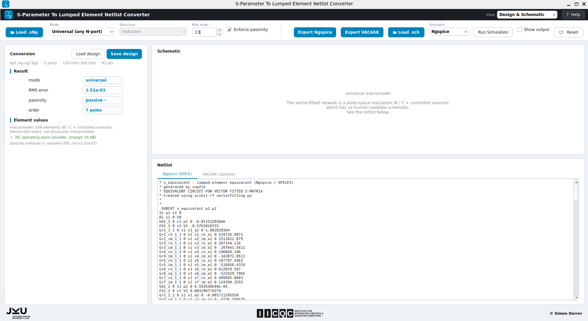
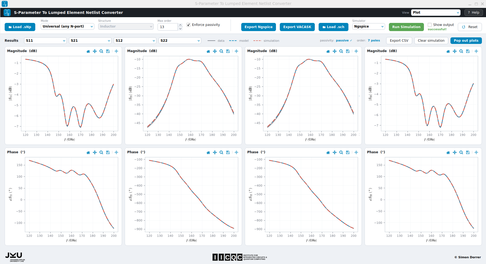

<p align="center">
  
</p>

# snp2le: S-Parameter To Lumped Element Netlist Converter

[](LICENSE)


(c) 2026 Simon Dorrer

Institute for Integrated Circuits and Quantum Computing (IICQC), Johannes Kepler University (JKU), Linz, Austria

> [!IMPORTANT]
> The converter (GUI and CLI) runs anywhere with **Python ≥ 3.10**, see [Install](#install) below.
> *Running* the exported netlists in a testbench additionally needs **Xschem** plus **Ngspice** and/or **VACASK**. The easiest way to get all of them is the [IIC-OSIC-TOOLS](https://github.com/iic-jku/IIC-OSIC-TOOLS) container.


## Description

**snp2le** turns a Touchstone **`.sNp`** S-parameter file (for example from an [AWS Palace](https://awslabs.github.io/palace/) EM simulation) into an equivalent **lumped-element netlist** for **Ngspice** (Berkeley SPICE3) and **VACASK** (Spectre syntax). An EM-extracted structure can then be co-simulated at circuit level, without re-running the field solve.

It offers two conversion philosophies:

- **Universal (any N-port).** Vector-fits the S-parameters with [scikit-rf](https://scikit-rf.org) `VectorFitting`, optionally enforces passivity, and synthesises a passive macromodel of R, C and controlled sources. It works for any structure and port count, and is electrically exact but not physically interpretable.
- **Structure-specific.** Fits a known physical topology, so every component maps to reality (series L, shunt C, coupling k, and so on) at a chosen **extraction frequency**. See [Available structures](#available-structures).

A single dialect-agnostic **Circuit IR** drives both netlist backends and the on-screen schematic, so the outputs always agree. The code is split into a pure-Python, Qt-free `snp2le.core` (fully unit-tested) and a thin PySide6 `snp2le.gui`, both driven by one entry point, `engine.convert(state, net)`.

<p align="center">
  <a href="doc/fig/snp2le_gui_bpf.png"></a><br>
  <em>The snp2le GUI converting a band-pass filter (BPF) S-parameter file into a lumped-element netlist.</em>
</p>

<p align="center">
  <a href="doc/fig/snp2le_plots_bpf.png"></a><br>
  <em>Plot view: loaded data (grey) vs extracted model (blue) vs imported testbench simulation (red).</em>
</p>


## Directory Structure

- 📄 **pyproject.toml** packaging metadata, dependencies and the `snp2le` entry point
- 📄 **MANIFEST.in** source-distribution manifest (bundles the examples and assets)
- 📄 **requirements.txt** runtime dependencies (mirrors `pyproject.toml`)
- 📁 **snp2le/** the application package (pip-installable)
  - 📄 `__init__.py` package version
  - 📄 `__main__.py` single entry point (`snp2le` opens the GUI, `snp2le -b` runs the CLI)
  - 📄 `app.py` GUI launcher
  - 📄 `cli.py` command-line interface
  - 📁 **core/** pure Python, Qt-free, all the maths
    - 📄 `engine.py` `convert(state, net)` returns `Results`, the single entry point
    - 📄 `io.py` load Touchstone (scikit-rf), parse Ngspice result tables
    - 📄 `units.py` engineering-notation parse and format
    - 📄 `ir.py` dialect-agnostic Circuit IR (element list and couplings)
    - 📄 `netlist.py` render the IR to Ngspice (SPICE3) and VACASK (Spectre)
    - 📄 `universal.py` vector-fit passive macromodel
    - 📄 `mna.py` rebuild N-port S-parameters from an RLC IR (model overlay)
    - 📄 `dc.py` DC operating-point (singularity) check for the macromodel
    - 📄 `state.py` `ConverterState` and `Results` dataclasses
    - 📄 `xschem.py` headless Xschem netlist and simulate commands
    - 📁 **structures/** physical extractors, one file per topology
      - 📄 `base.py`, `inductor_pi.py`, `mim_cap.py`, `tline.py`
      - 📄 `wilkinson.py`, `balun.py`, `branchline.py`
      - 📄 `__init__.py` registry (the GUI dropdown and CLI auto-discover it)
  - 📁 **gui/** PySide6, no maths
    - 📄 `main_window.py` the controller
    - 📄 `top_bar.py` load, mode, structure, options, simulator, run
    - 📄 `design_view.py` result, element values, tolerances, schematic, netlist
    - 📄 `plot_view.py` four S-parameter or extracted-parameter plots
    - 📄 `help_dialog.py`, `style.py`, `widgets.py`, and more
    - 📁 **assets/** logos (svg and png), `snp2le.ico`
  - 📁 **examples/** Touchstone `.sNp` sample files (BPF, inductor, balun, BLC, WPD, and more)
- 📁 **tests/** pytest suite (`test_core.py`)
- 📁 **doc/** `architecture.md` and screenshots (in `fig/`)
- 📁 **testbenches/xschem/** BPF testbenches (Ngspice and VACASK) plus postprocess eval scripts
- 📁 **netlist/** exported lumped-element netlists
  - 📁 **spice/** Ngspice (`.spice`)
  - 📁 **spectre/** VACASK (`.inc`) plus `syntax_cheatsheet.inc`
- 📁 **schematic/xschem/** DUT symbol (`bpf_le.sym`) and `xschemrc`
- 📁 **sim_data/** simulation results, imported and overlaid on the plots
- 📄 **README.md**, 📄 **LICENSE** (Apache-2.0), 📄 **CITATION.cff**


## How to Use

### Install

From PyPI:

```bash
pip install snp2le
# or, for an isolated install with its own command on PATH:
pipx install snp2le
```

From source (for development), an editable install pulls in every dependency:

```bash
git clone https://github.com/iic-jku/snp2le.git
cd snp2le

python -m venv .venv
# Windows:        .venv\Scripts\activate
# macOS / Linux:  source .venv/bin/activate

pip install -e .
```

### Run the GUI

```bash
snp2le              # after installing (pip / pipx)
python -m snp2le    # from the repo root of a source checkout, no install needed
```

A bundled example is preloaded on first run. More live in `snp2le/examples/`.

> [!NOTE]
> Start it as a module (`python -m snp2le`), not `python snp2le/app.py`. The launcher
> imports the `snp2le` package, which Python only finds when it is run as a module from
> the repo root (or after `pip install`).

### Typical workflow

1. **Load** a Touchstone `.sNp` file from the top bar. The header shows the port count and frequency range.
2. **Choose a mode.** Universal (set *Max order* and *Enforce passivity*) or Structure-specific (pick a structure and set the *extraction frequency*). Some structures expose an extra option such as *Stages*, *Isolation R* or *Resistive loss*.
3. **Inspect** the result, element values, per-element **tolerances** at the extraction frequency, the drawn schematic, and the generated netlist in the **Design & Schematic** view.
4. **Compare** the loaded data (grey) against the extracted model (blue) in the **Plot** view (up to four traces, magnitude and phase).
5. **Export** the netlist. *Export Ngspice* writes a `.spice` file and *Export VACASK* writes an `.inc` file. The `.SUBCKT` is named after the file, so a testbench that instantiates it resolves the include.

> [!TIP]
> The **Help** button in the top bar opens a full in-app guide to every control.

### Run a testbench (simulate)

Drop the exported subcircuit into an Xschem testbench, then run it from the GUI:

1. **Load .sch.** Pick the testbench. The **Simulator** auto-selects from the file name (a name ending in `_ngspice.sch` selects Ngspice or `_vacask.sch` selects VACASK) and can be overridden.
2. **Run Simulation.** Both simulators netlist and simulate through Xschem and write their result to `sim_data/`, which is imported and overlaid on the plots automatically. The button turns green on success or red on failure. On failure the dialog shows the simulator log.
3. **Show output.** Tick it to show the simulator's console and plot windows. Leave it unticked to run quietly. The result is imported either way.

> [!NOTE]
> A simulator (Xschem plus Ngspice and/or VACASK) is only needed for this step. The conversion and export themselves are pure Python.

### Run the tests

```bash
pytest               # from the repo root
```


## CLI Overview

The same engine is available headlessly for Makefiles and batch use, through the `-b` (batch) flag:

```bash
snp2le -b list-structures
snp2le -b convert <file.sNp> [options]
```

From a source checkout without installing, use `python -m snp2le -b ...` in place of `snp2le -b`.

### `convert` options

| Option | Scope | Description |
| --- | --- | --- |
| `inputs` | all | one or more `.sNp` files or globs |
| `--mode universal\|structure` | both | conversion philosophy (default `universal`) |
| `--structure KEY` | structure | structure key (see `list-structures`) |
| `--order N` | universal | maximum model order (poles) |
| `--passive` / `--no-passive` | universal | enforce passivity (default on) |
| `--fext FREQ` | structure | extraction frequency, e.g. `7GHz` |
| `--stages N` | structure | RLGC ladder cells (transmission line) |
| `--iso-r` / `--no-iso-r` | structure | Wilkinson isolation R or branch-line arm loss |
| `--format ngspice\|vacask\|both` | both | output dialect(s). VACASK writes `.inc` |
| `-o, --output PATH` | both | output path (single input), names the `.SUBCKT` |
| `--values` | structure | print the extracted element values |
| `--tolerances` | structure | print per-element tolerances at `f_ext` |
| `--simulate SCH` | sim | run an Xschem testbench after converting |
| `--simulator ngspice\|vacask` | sim | simulator for `--simulate` (default: auto from `.sch` name) |
| `--show-output` | sim | show the simulator's console and plot windows |
| `--timeout S` | sim | seconds to wait for a `--simulate` result (default 180) |
| `--plot [SPARAMS]` | sim | display data, model and sim plots (e.g. `S11,S21`) |
| `--quiet` | both | suppress the per-file status line |

### Examples

```bash
# universal macromodel to an Ngspice netlist
snp2le -b convert coupler.s4p --mode universal --order 12 -o coupler.spice

# structure extraction at 7 GHz, both dialects, print values and tolerances
snp2le -b convert ind.s2p --mode structure --structure inductor-pi \
    --fext 7GHz --format both --values --tolerances

# convert the BPF, run its Xschem testbench, and show data vs model vs sim plots
snp2le -b convert snp2le/examples/bpf_ihp-sg13g2.s2p \
    --mode universal --order 13 -o netlist/spice/bpf_le.spice \
    --simulate testbenches/xschem/bpf_le_tb_acsp_ngspice.sch --plot
```

> [!NOTE]
> `--simulate` and `--plot` need Xschem (and a display for `--plot`). They print a clear message and skip if Xschem is not on `PATH`.


## Available structures

| Key | Model | Ports | Notes |
| --- | --- | --- | --- |
| `inductor-pi` | Inductor | 2 | series R-L plus shunt C/R per port |
| `mim-cap` | MIM capacitor | 2 | series C with parasitic L/R plus shunt C (use it for MOM caps too) |
| `tline-rlgc` | Transmission line (RLGC) | 2 | N-cell pi-ladder (`--stages`) |
| `wilkinson-inphase` | Wilkinson divider (in-phase) | 3 | optional isolation resistor (`--iso-r`) |
| `wilkinson` | Wilkinson divider (quadrature) | 3 | quadrature (90 deg) outputs |
| `balun` | Balun (transformer) | 4 | coupled inductors (k, M, n), Qp and Qs |
| `branchline` | Branch-line coupler | 4 | optional fitted arm loss (`--iso-r`) |

New structures plug in by subclassing `snp2le.core.structures.base.Structure` and registering them in `snp2le/core/structures/__init__.py`. They then appear in the GUI dropdown and the CLI automatically.


## Cite This Work

```
@misc{2026_snp2le,
  author = {Dorrer, Simon},
  month = july,
  year = {2026},
  title = {{GitHub Repository for snp2le: A S-Parameter To Lumped Element Netlist Converter}},
  url = {https://github.com/iic-jku/snp2le},
  doi = {ToDo}
}
```


## Acknowledgements

- The structure-specific extractors (inductor, MIM capacitor, RLGC line) were inspired by Volker Mühlhaus' [lumpedmodel](https://github.com/VolkerMuehlhaus/lumpedmodel).
- The passivity-enforcement strategy for the universal macromodel was adapted from the [COBRA project](https://github.com/DI-PASSIONATE/COBRA).
- Vector fitting is provided by [scikit-rf](https://scikit-rf.org).

<p align="center">
  
</p>


## License

Licensed under the **Apache License 2.0**, see [`LICENSE`](LICENSE).
